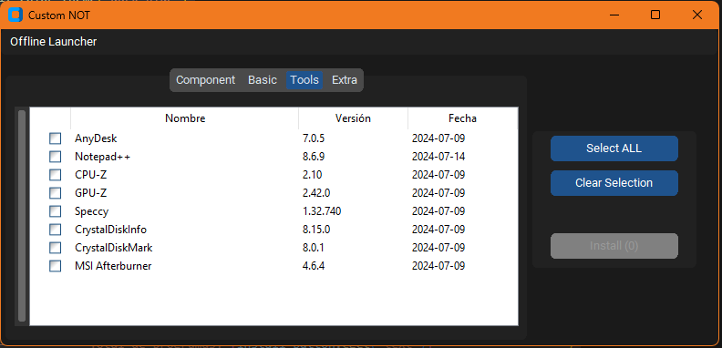

# NeverOneTool

**NeverOneTool** es una herramienta de instalación todo-en-uno diseñada para simplificar el proceso de configuración de tu entorno de software. Permite gestionar e instalar múltiples programas esenciales de manera rápida y eficiente.

## Características

- **Instalación de Múltiples Programas**: Selecciona e instala varios programas con un solo clic.
- **Interfaz Amigable**: Interfaz gráfica intuitiva y fácil de usar.
- **Personalización**: Agrega y organiza programas según tus necesidades.
- **Actualizaciones**: Mantén tus programas actualizados con las versiones más recientes.

## Requisitos

- **Sistema Operativo**: Windows 7 o superior
- **Python**: 3.8 o superior
- **Dependencias**: `tkinter` , `customtkinter`, `ttkwidgets`, `json`

## Instalación

1. Clona el repositorio:

    ```sh
    git clone https://github.com/tu_usuario/NeverOneTool.git
    ```

2. Navega al directorio del proyecto:

    ```sh
    cd NeverOneTool
    ```

3. Instala las dependencias necesarias:

    ```sh
    pip install -r requirements.txt
    ```

4. Ejecuta el programa:

    ```sh
    python main.py
    ```

## Uso

1. **Lanza la Aplicación**: Inicia NeverOne para abrir la interfaz gráfica.
2. **Selecciona Programas**: Navega entre las pestañas y selecciona los programas que deseas instalar.
3. **Instala**: Haz clic en el botón "Instalar" para comenzar la instalación de los programas seleccionados.

## Ejemplo



## Contribuciones

¡Las contribuciones son bienvenidas! Si quieres ayudar a mejorar **NeverOneTool**, sigue estos pasos:

1. Haz un fork del repositorio.
2. Crea una nueva rama para tus cambios.
3. Envía un pull request con una descripción detallada de los cambios.


## Contacto

Para preguntas o sugerencias, por favor contacta a [yonuel01@hotmail.com](mailto:yonuel01@hotmail.com).

---

¡Gracias por usar **NeverOneTool**! Esperamos que te ayude a simplificar tu experiencia de instalación de software.
